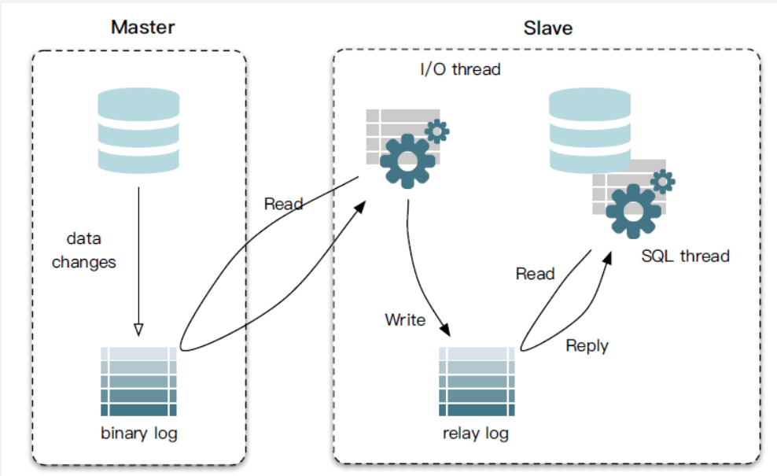
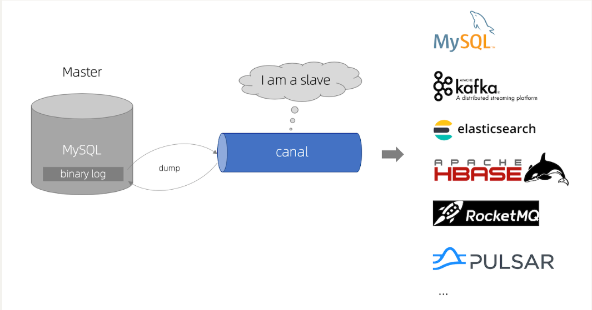
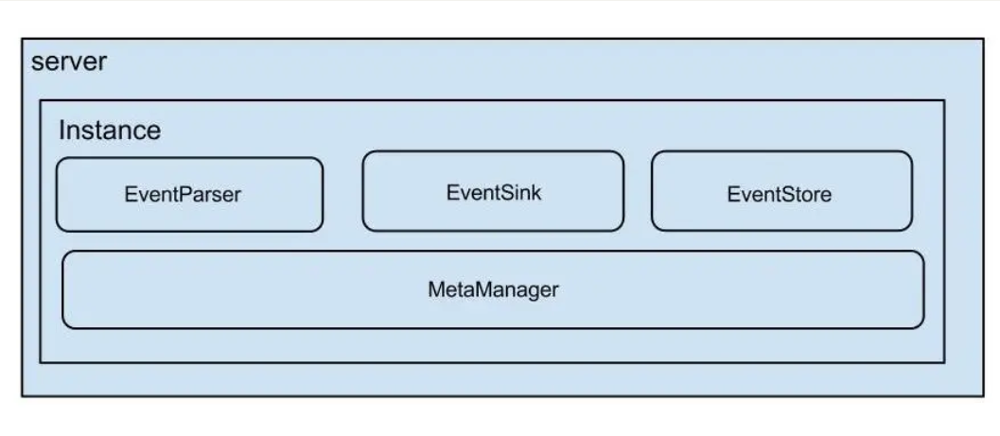
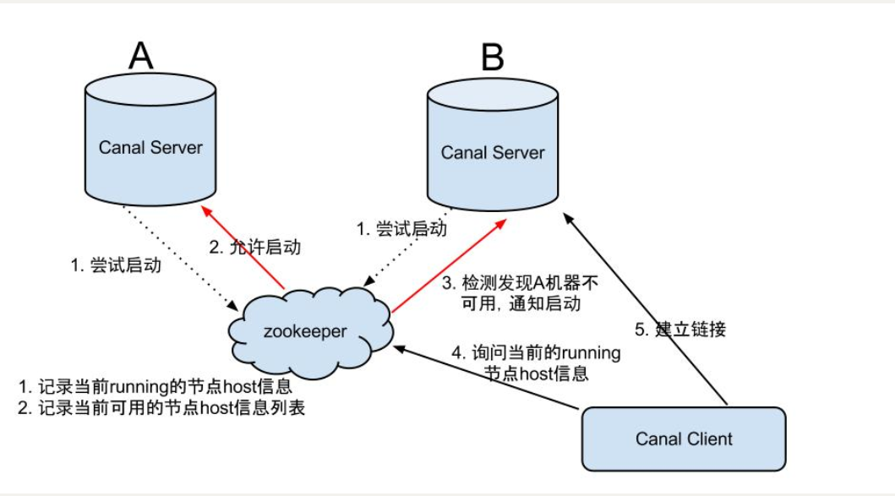
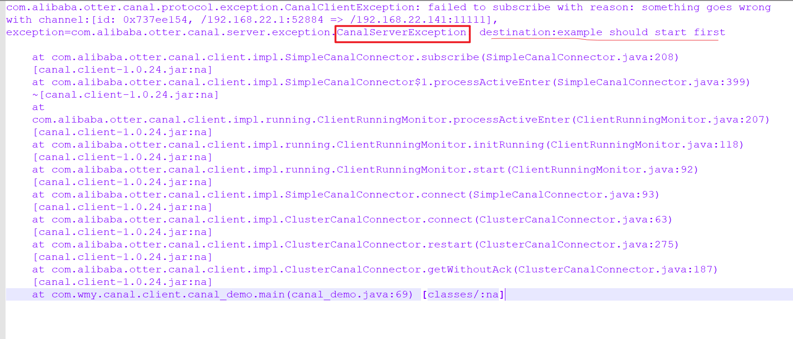
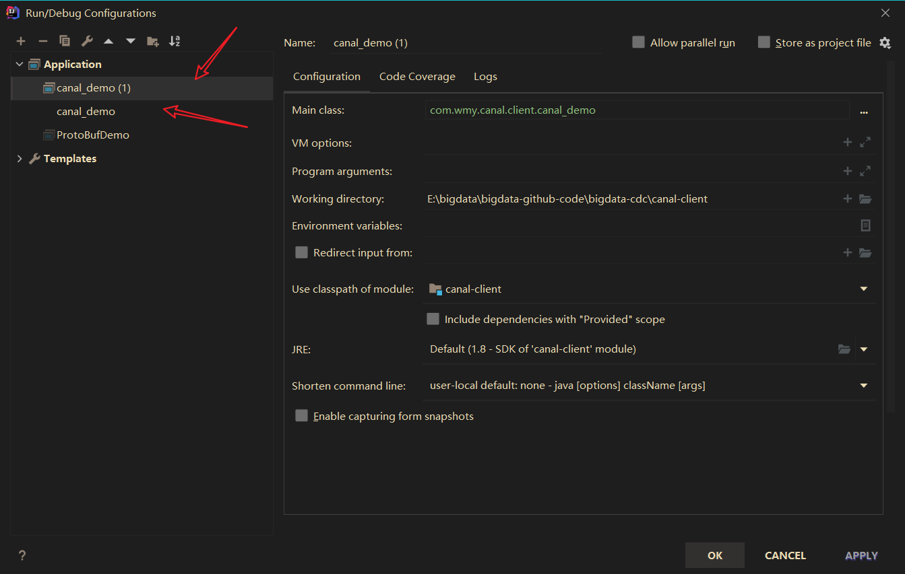
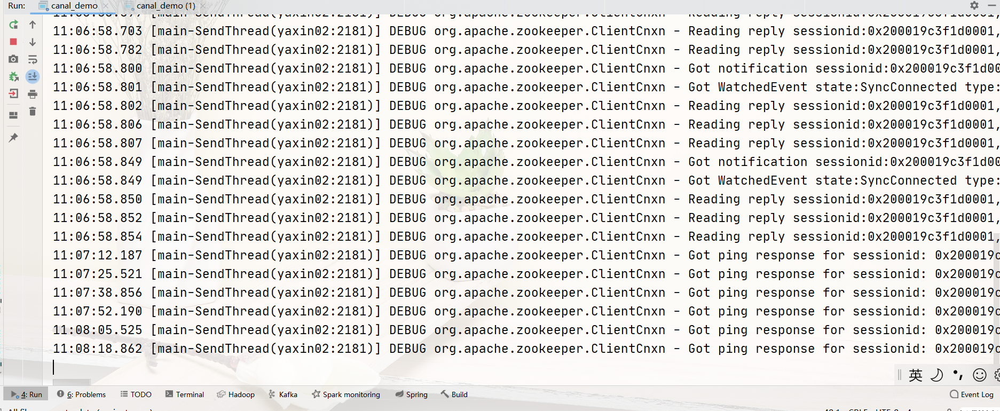
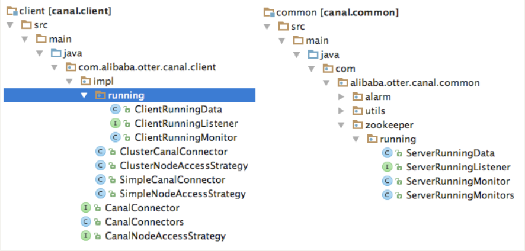

# canal

## canal 服务端部署

### 1、部署MySQL配置

我的MySQL是单节点的，同时我部署canal也是单节点的

~~~properties
vim /etc/my.cnf

# canal部署
log-bin=mysql-bin # 开启 binlog
binlog-format=ROW # 选择 ROW 模式
server_id=1 # 配置 MySQL replaction 需要定义，不要和 canal 的 slaveId 重复

如果MySQL是集群的，这个server_id是一定不要重复的

systemctl restart mysqld
~~~

### 2、Canal部署

~~~properties
[root@yaxin01 conf]# pwd
/opt/module/canal/conf
[root@yaxin01 conf]# ll
total 8
-rwxrwxrwx 1 root root 2521 Apr  1  2017 canal.properties
drwxrwxrwx 2 root root   33 Jul 25 04:55 example
-rwxrwxrwx 1 root root 3055 Apr  1  2017 logback.xml
drwxrwxrwx 2 root root  138 Jul 25 04:55 spring

vim canal.properties

/opt/module/canal/conf/spring ---> 实例的相关参数配置
default-instance.xml ---> 偏移量，单机，不需要配置在ZK中
/opt/module/canal/conf/example ---> 实例

[root@yaxin01 example]# pwd
/opt/module/canal/conf/example
[root@yaxin01 example]# ll
total 4
-rwxrwxrwx 1 root root 751 Apr  1  2017 instance.properties

canal.instance.master.address = yaxin01:3306
canal.instance.dbUsername = root
canal.instance.dbPassword = 000000

~~~

#### 2.1 启动

~~~properties
[root@yaxin01 bin]# pwd
/opt/module/canal/bin
[root@yaxin01 bin]# ./startup.sh 
cd to /opt/module/canal/bin for workaround relative path
LOG CONFIGURATION : /opt/module/canal/bin/../conf/logback.xml
canal conf : /opt/module/canal/bin/../conf/canal.properties
CLASSPATH :/opt/module/canal/bin/../conf:/opt/module/canal/bin/../lib/zookeeper-3.4.5.jar:/opt/module/canal/bin/../lib/zkclient-0.1.jar:/opt/module/canal/bin/../lib/spring-2.5.6.jar:/opt/module/canal/bin/../lib/slf4j-api-1.7.12.jar:/opt/module/canal/bin/../lib/protobuf-java-2.6.1.jar:/opt/module/canal/bin/../lib/oro-2.0.8.jar:/opt/module/canal/bin/../lib/netty-all-4.1.6.Final.jar:/opt/module/canal/bin/../lib/netty-3.2.5.Final.jar:/opt/module/canal/bin/../lib/logback-core-1.1.3.jar:/opt/module/canal/bin/../lib/logback-classic-1.1.3.jar:/opt/module/canal/bin/../lib/log4j-1.2.14.jar:/opt/module/canal/bin/../lib/jcl-over-slf4j-1.7.12.jar:/opt/module/canal/bin/../lib/guava-18.0.jar:/opt/module/canal/bin/../lib/fastjson-1.2.28.jar:/opt/module/canal/bin/../lib/commons-logging-1.1.1.jar:/opt/module/canal/bin/../lib/commons-lang-2.6.jar:/opt/module/canal/bin/../lib/commons-io-2.4.jar:/opt/module/canal/bin/../lib/commons-beanutils-1.8.2.jar:/opt/module/canal/bin/../lib/canal.store-1.0.24.jar:/opt/module/canal/bin/../lib/canal.sink-1.0.24.jar:/opt/module/canal/bin/../lib/canal.server-1.0.24.jar:/opt/module/canal/bin/../lib/canal.protocol-1.0.24.jar:/opt/module/canal/bin/../lib/canal.parse.driver-1.0.24.jar:/opt/module/canal/bin/../lib/canal.parse.dbsync-1.0.24.jar:/opt/module/canal/bin/../lib/canal.parse-1.0.24.jar:/opt/module/canal/bin/../lib/canal.meta-1.0.24.jar:/opt/module/canal/bin/../lib/canal.instance.spring-1.0.24.jar:/opt/module/canal/bin/../lib/canal.instance.manager-1.0.24.jar:/opt/module/canal/bin/../lib/canal.instance.core-1.0.24.jar:/opt/module/canal/bin/../lib/canal.filter-1.0.24.jar:/opt/module/canal/bin/../lib/canal.deployer-1.0.24.jar:/opt/module/canal/bin/../lib/canal.common-1.0.24.jar:/opt/module/canal/bin/../lib/aviator-2.2.1.jar:
cd to /opt/module/canal/bin for continue

[root@yaxin01 bin]# jps
1656 CanalLauncher
1676 Jps

如果说有问题的话，可以去查看日志
[root@yaxin01 example]# pwd
/opt/module/canal/logs/example
[root@yaxin01 example]# vim example.log
~~~

## canal客户端开发

### 1、pom.xml

~~~properties
<dependencies>
	<dependency>
    	<groupId>com.alibaba.otter</groupId>
        <artifactId>canal.client</artifactId>
        <version>1.0.24</version>
    </dependency>
    <dependency>
        <groupId>com.alibaba</groupId>
        <artifactId>fastjson</artifactId>
        <version>1.2.58</version>
    </dependency>
</dependencies>
~~~

### 2、数据格式

~~~properties
Entry  
    Header  
        logfileName [binlog文件名]  
        logfileOffset [binlog position]  
        executeTime [binlog里记录变更发生的时间戳,精确到秒]  
        schemaName   
        tableName  
        eventType [insert/update/delete类型]  
    entryType   [事务头BEGIN/事务尾END/数据ROWDATA]  
    storeValue  [byte数据,可展开，对应的类型为RowChange]  
RowChange
    isDdl       [是否是ddl变更操作，比如create table/drop table]
    sql         [具体的ddl sql]
rowDatas    [具体insert/update/delete的变更数据，可为多条，1个binlog event事件可对应多条变更，比如批处理]
    beforeColumns [Column类型的数组，变更前的数据字段]
    afterColumns [Column类型的数组，变更后的数据字段]
    Column
    index
    sqlType     [jdbc type]
    name        [column name]
    isKey       [是否为主键]
    updated     [是否发生过变更]
    isNull      [值是否为null]
    value       [具体的内容，注意为string文本]
~~~

### 3、封装好的JSON格式

~~~json
{
	"logfileOffset": 68046713,
	"columns": {
		"adName": "3F",
		"positionType": "1",
		"adURL": "",
		"dataFlag": "1",
		"adEndDate": "2031-08-29",
		"adPositionId": "304",
		"adSort": "0",
		"adClickNum": "0",
		"adId": "53",
		"subTitle": "3F",
		"adStartDate": "2016-02-01",
		"createTime": "2019-02-23 14:56:05",
		"adFile": "upload/adspic/2019-02/5c70ee704a548.png"
	},
	"logfileName": "mysql-bin.000001",
	"eventType": "update",
	"schemaName": "itcast_shop",
	"executeTime": 1627206766000,
	"tableName": "itcast_ads"
}

每条数据都有很多的属性名称，1000条数据就有很多属性名称，属性名称就会出现很多冗余
1、占用了服务器的存储资源
2、因为数据体积大，占用了服务器的带
~~~

## Protocol Buffer

### 1、Protocol Buffer初步使用

~~~properties
JSON的可读性很强，Protocol是二进制数据，可读性要较差一些
java中使用Protocol的格式，很适合数据存或RPC数据交换格式
~~~

~~~properties
<dependencies>
        <dependency>
            <groupId>com.google.protobuf</groupId>
            <artifactId>protobuf-java</artifactId>
            <version>3.4.0</version>
        </dependency>
</dependencies>

<build>
        <extensions>
            <extension>
                <groupId>kr.motd.maven</groupId>
                <artifactId>os-maven-plugin</artifactId>
                <version>1.6.2</version>
            </extension>
        </extensions>
        <plugins>
            <!-- Protobuf插件 -->
            <plugin>
                <groupId>org.xolstice.maven.plugins</groupId>
                <artifactId>protobuf-maven-plugin</artifactId>
                <version>0.5.1</version>
                <configuration>
                    <protoSourceRoot>${project.basedir}/src/main/proto</protoSourceRoot>
                    <protocArtifact>
                        com.google.protobuf:protoc:3.1.0:exe:${os.detected.classifier}
                    </protocArtifact>
                </configuration>
                <executions>
                    <execution>
                        <goals>
                            <goal>compile</goal>
                        </goals>
                    </execution>
                </executions>
            </plugin>
        </plugins>
    </build>
~~~

序列化和反序列来进行使用，了解ProtocolBuf格式，减少存储资源和网络资源，代码如何进行封装

### 2、将message 转换成Protocol Buf

## Canal原理

### MySQL主备复制原理

### Canal工作原理

### 架构

### server/client交互协议

~~~properties
server就是一个实例，就是JVM进程
数据在MySQL中，binlog日志，canal server，server端和binlog日志如何交互,通过EventParser发送端口协议，模拟的是dump协议，master协议，sink是一个连接器，
Store是一个数据存储
增量订阅和消费信息的管理器，itcast_shop
一般我们都是不指定timeout的
~~~

### EventStore

~~~properties
每一次记录拉取的位置，是有offset，MetaManager，记录位置信息，
把parse解析，存储，过滤，分发，都是sink来进行操作的，sink之前，禁止数据在处理的，是一个阻塞的状态
1、获取保存位置
2、发送端口协议
3、推送Binlog
4、解析binlog
5、传递sink
6、定时记录解析的binlog位置
~~~

## 能力要求

~~~properties
1、掌握Canal高可用环境搭建
2、编写Flink程序解析kafka中的ProtoBuf
3、搭建Flink实时ETL项目开发环境
4、针对ETL的业务处理进行封装公共接口
~~~

## Canal高可用环境搭建

### 1、服务器端HA模式配置

~~~properties
Canal是支持HA的，依赖ZK，用Watcher,phemeral节点和session什么周期的绑定
1、canal server为了减少MySQL的dump请求，要求同一时间只有一个running
2、canal client：有序性，同一时间只能有一个canal client进行get/ack/rollback操作，否则客户端接收无法保证有序
~~~

### 2、机器准备

~~~properties
运行canal机器：yaxin01,yaxin02
zookeeper地址为：yaxin01:2181,yaxin02:2181,yaxin03:2181
MySQL地址：yaxin01:3306
~~~

### 3、Canal HA服务器配置

~~~properties
1、修改canal.properties，加上zookeeper配置
[root@yaxin01 conf]# pwd
/opt/module/canal/conf
[root@yaxin01 conf]# vim canal.properties 

canal.zkServers=yaxin01:2181,yaxin02:2181,yaxin03:2181
#canal.instance.global.spring.xml = classpath:spring/file-instance.xml
canal.instance.global.spring.xml = classpath:spring/default-instance.xml

2、创建example目录，并修改instance.properties
canal.instance.mysql.slaveId = 1234 ##另外一台机器改成1235，保证slaveId不重复即可
canal.instance.master.address = yaxin01:3306

注意： 两台机器上的instance目录的名字需要保证完全一致，HA模式是依赖于instance name进行管理，同时必须都选择default-instance.xml配置

3、分发到yaxin02
scp -r canal yaxin02:`pwd`
分发之后，把instance给改成1235，否则MySQL服务端会出现问题
[root@yaxin02 example]# pwd
/opt/module/canal/conf/example
[root@yaxin02 example]# vim instance.properties 
canal.instance.mysql.slaveId = 1235

注意：需要在bin目录下，把pid给删除掉
[root@yaxin01 bin]# pwd
/opt/module/canal/bin
[root@yaxin01 bin]# rm -rf canal.pid

4、进程查看
[root@yaxin01 bin]# xcall.sh jps
------------------------ jps yaxin01 ------------------------
2866 CanalLauncher
2904 Jps
2794 QuorumPeerMain
------------------------ jps yaxin02 ------------------------
2422 Jps
2392 CanalLauncher
2314 QuorumPeerMain
------------------------ jps yaxin03 ------------------------
2130 QuorumPeerMain
2190 Jps

5、查看日志
[root@yaxin01 example]# pwd
/opt/module/canal/logs/example
[root@yaxin01 example]# tail -F example.log 
start successful....

可用的节点就是只有yaxin01
[root@yaxin02 example]# pwd
/opt/module/canal/logs/example
[root@yaxin02 example]# tail -F example.log 
prepare to find start position just show master status

6、查看ZK的节点信息
yaxin01
[zk: localhost:2181(CONNECTED) 1] get /otter/canal/destinations/example/running
{"active":true,"address":"192.168.22.140:11111","cid":1}

yaxin02
[zk: localhost:2181(CONNECTED) 1] ls /otter/canal/destinations/example/running
[]

~~~

### 4、客户端连接，消费数据

~~~properties
1、可以直接指定zookeeper地址和instance name，canal client会自动从zookeeper中的running节点，获取当前服务的工作节点，然后与其建立链接：

CanalConnector connector = CanalConnectors.newClusterConnector("yaxin01:2181", "example", "canal", "canal");

2、链接成功后，canal server会记录当前正在工作的canal client信息，比如客户端ip，链接的端口信息等
[zk: localhost:2181(CONNECTED) 17] get /otter/canal/destinations/example/1001/running
{"active":true,"address":"192.168.22.1:60957","clientId":1001}

3、数据消费成功后，canal server会在zookeeper中记录下当前最后一次消费成功的binlog位点.  (下次重启client时，会从这最后一个位点继续进行消费)
[zk: localhost:2181(CONNECTED) 1]  get /otter/canal/destinations/example/1001/
cursor    filter    running   
[zk: localhost:2181(CONNECTED) 1]  get /otter/canal/destinations/example/1001/cursor
{"@type":"com.alibaba.otter.canal.protocol.position.LogPosition","identity":{"slaveId":-1,"sourceAddress":{"address":"yaxin01","port":3306}},"postion":{"included":false,"journalName":"mysql-bin.000001","position":68047838,"serverId":1,"timestamp":1627268042000}}

包含，消费者slaveId，一些基本的位置信息，最后一次消费成功的位置信息，加入想测试HA是否可用
停掉yaxin01中的canal server，MySQL的binlog日志一样是可用消费到的

4、如何查看是否启动成功了，已经成功的切换到了yaxin02，说明zk的选举机制可用选取为可用节点
[zk: localhost:2181(CONNECTED) 1] get /otter/canal/destinations/example/running
{"active":true,"address":"192.168.22.141:11111","cid":1}
~~~

### 5、重启一下canal server

~~~properties
停止正在工作的node1的canal server
ssh yaxin01 
sh bin/stop.sh

这时node2会立马启动example instance，提供新的数据服务
 [zk: localhost:2181(CONNECTED) 19] get /otter/canal/destinations/example/running
{"active":true,"address":"192.168.22.144:11111","cid":1}
~~~

### 6、Canal Server HA的流程图

### 7、查看IDEA监测到yaxin01不可用的变化

## 客户端HA模式配置

Canal Client的方式和canal server方式类似，也是利用zookeeper的抢占ephemeral节点的方式进行控制。HA的实现，客户端是ClientRunningMonitor，服务端是ServerRunningMonitor。

直接取若干个Canal客户端，如果同时启动，只有一个客户端能从Canal服务器端获取到binlog消息，其他客户端不能拉取到binlog消息。

从运行配置中，复制一个同样的配置。然后启动运行。

采集MySQL-binlog日志，查看是否是只有一个client端就行收集

关掉之前的客户端，然后稍微等待一会，查看另外一个客户端是否能够获取到binlog日志消息。

Client1的日志：

停止Client1后，Client2的日志：

观察ZK节点中instance对应的client节点，在Client切换时，会进行变更。
比如下面的客户端从64633端口切换到了57270端口。
把所有客户端都关闭后，1001下没有running。表示instance没有客户端消费binlog了。

~~~properties
启动两个客户端，第一个客户端（56806）正在运行
[zk: localhost:2181(CONNECTED) 2] get /otter/canal/destinations/example/1001/running
{"active":true,"address":"192.168.22.1:64633","clientId":1001}

停止第一个客户端，删除节点
[zk: localhost:2181(CONNECTED) 2] get /otter/canal/destinations/example/1001/running
{"active":true,"address":"192.168.22.1:57270","clientId":1001}

[zk: localhost:2181(CONNECTED) 2] ls /otter/canal/destinations/example/1001
[cursor, filter, running]
~~~

具体实现相关类有：ClientRunningMonitor/ClientRunningListener/ClientRunningData。

client running相关控制，主要为解决client自身的failover机制。
canal client允许同时启动多个canal client，
通过running机制，可保证只有一个client在工作，其他client做为冷备.
当运行中的client挂了，running会控制让冷备中的client转为工作模式，
这样就可以确保canal client也不会是单点. 保证整个系统的高可用性.

下图左边是客户端的HA实现，右边是服务端的HA实现

